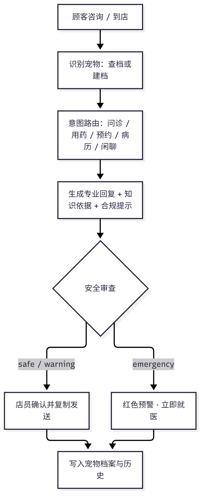
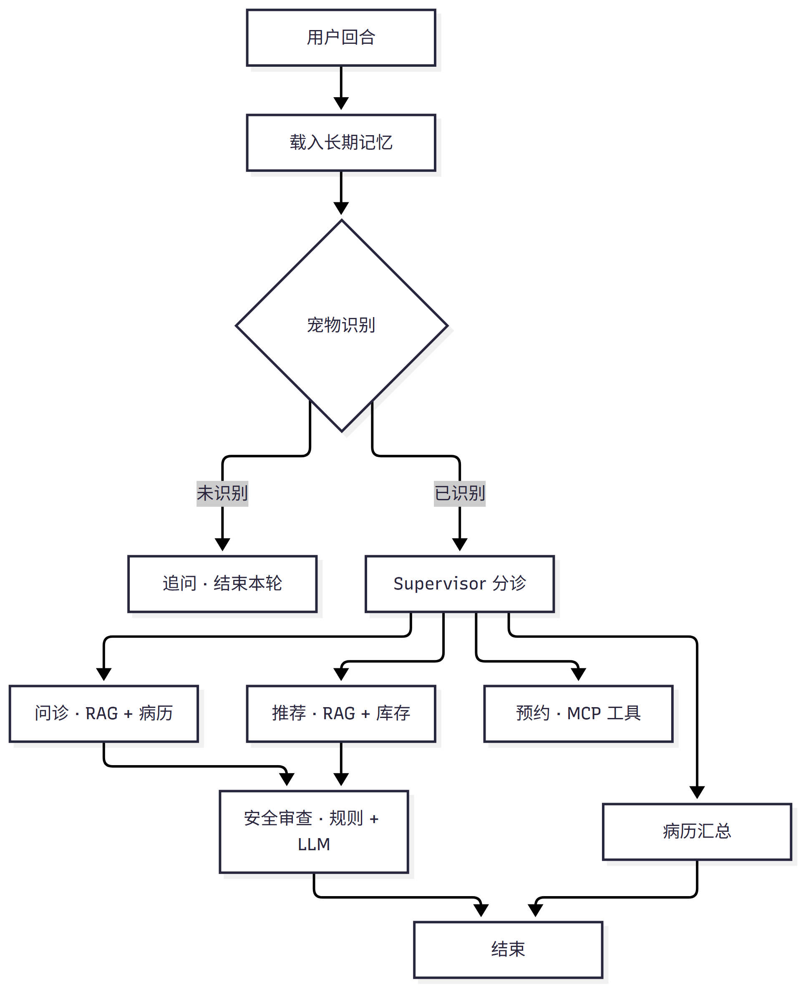
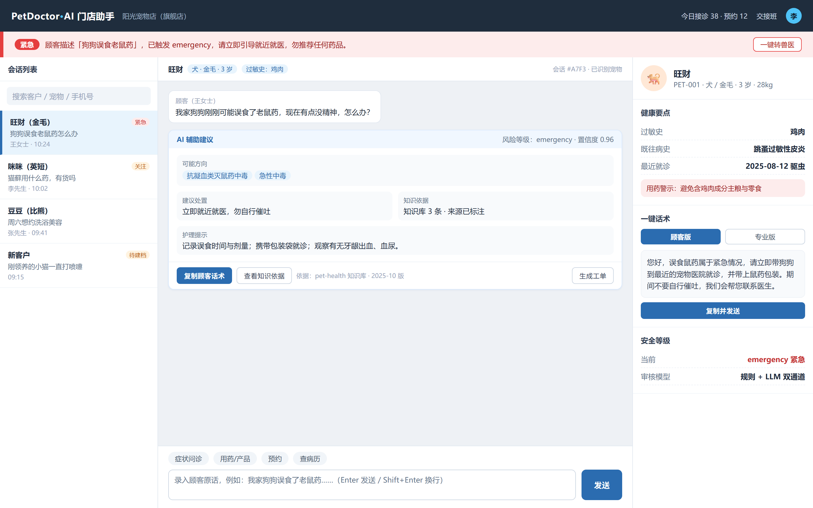
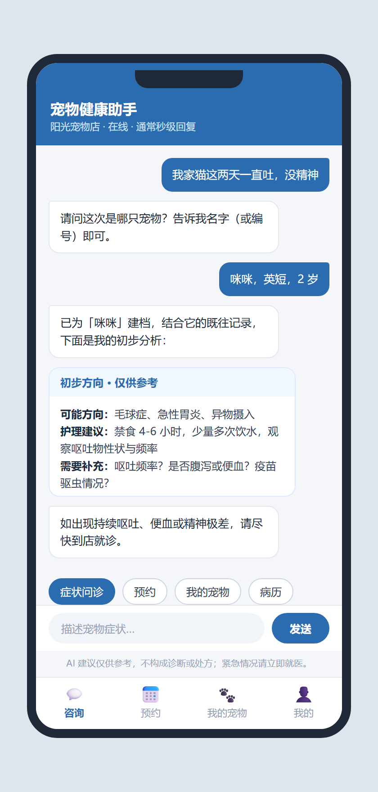

# 宠物店智能问诊与运营助手 · 产品需求文档（PRD）

> **Product Requirements Document (PRD) · V2.0**

| 项目 | 内容 |
|------|------|
| 文档名称 | 宠物店智能问诊与运营助手 · 产品需求文档（PRD） |
| 文档版本 | V2.0 |
| 项目代号 | PetDoctorAgent |
| 编制日期 | 2026 年 10 月 6 日 |
| 文档状态 | 评审稿（Draft for Review） |
| 适用读者 | 产品 / 研发 / 设计 / 运营 / 兽医顾问 |

> 本文档为产品规划文件，涉及医疗建议的部分均不构成诊断或处方；实际诊疗须由执业兽医实施。

---

## 目录

1. [产品背景](#1-产品背景)
2. [用户画像](#2-用户画像)
3. [使用案例](#3-使用案例)
4. [产品定位与整体方案](#4-产品定位与整体方案)
5. [功能需求](#5-功能需求)
6. [AI 能力与系统架构](#6-ai-能力与系统架构)
7. [界面原型](#7-界面原型)
8. [项目里程碑与风险](#8-项目里程碑与风险)
9. [验收标准与开放问题](#9-验收标准与开放问题)
10. [附录](#附录)

---

## 1 产品背景

### 1.1 行业背景

宠物经济持续升温，中国城镇犬猫消费市场已成长为千亿级规模，其中宠物医疗是仅次于宠物食品的第二大支出板块。与此同时，线下宠物门店数量庞大、以中小型单店与社区连锁为主，普遍面临医疗专业人才稀缺、人员流动快、服务标准化程度低的现实。

一方面，宠物主人对“看得见、问得清、信得过”的健康服务诉求不断提升；另一方面，门店受限于成本，难以长期配备全职兽医。如何在“没有兽医坐诊”的时段仍提供专业、合规、可追溯的初步咨询与业务服务，成为门店经营的关键命题。

### 1.2 市场需求与核心痛点

本产品由实体宠物店经营方发起，源于真实经营场景。门店最突出的两大约束是「人手不足」与「普通店员医疗专业知识不足」，由此衍生出以下核心痛点：

| 编号 | 市场痛点 | 业务影响 |
|:----:|----------|----------|
| P1 | 高峰期咨询响应慢，顾客排队等待 | 顾客流失、成交转化率下降 |
| P2 | 店员专业能力不足，答不准方向与禁忌 | 专业信任度下降、复购减少 |
| P3 | 用药建议不合规，存在处方药与跨物种用药风险 | 医疗事故隐患、法律与声誉风险 |
| P4 | 服务口径不统一，不同店员说法不一 | 管理成本高、顾客体验割裂 |
| P5 | 经验难以沉淀，老员工经验随离职流失 | 培训成本高、服务质量波动 |
| P6 | 预约、库存、病历分散割裂 | 作业效率低、信息不同步 |
| P7 | 紧急情况识别缺失，缺乏转诊机制 | 延误救治、重大安全风险 |

上述痛点的本质，是门店缺少一个既懂专业知识、又懂门店业务、还能守住合规底线的“数字员工”。

### 1.3 产品目标与非目标

- **业务目标：**普通店员在 AI 辅助下承接约 80% 的常规咨询；高峰期响应降至秒级；统一合规口径；沉淀门店数字资产。
- **体验目标：**店员 30 分钟内上手；顾客获得即时、专业、可追溯的服务；紧急情况 100% 识别并引导转诊。
- **北极星指标：**AI 辅助门店接诊单量（有效咨询会话数）。

非目标（Non-goals）：不做诊断与处方闭环，不开展药品交易闭环，不追求全病种覆盖，暂不涉足异宠深度诊疗。

---

## 2 用户画像

### 2.1 角色总览

产品围绕门店经营链条上的五类角色设计，其中「普通店员」为首要用户，「店长 / 店主」为主要决策者，「宠物主人」为服务最终受益人。

| 角色 | 角色定位 | 核心诉求 | 使用频率 |
|------|----------|----------|----------|
| 普通店员 | 首要用户 / 操作者 | 快速拿到专业且合规的回复话术 | 极高（每日） |
| 店长 / 店主 | 决策者 / 管理者 | 数据看板、口径管理、降本增效 | 高（每日） |
| 驻店 / 合作兽医 | 专业把关者 | 审核知识库、处理疑难与转诊 | 中（按需） |
| 宠物主人 | 最终受益人 / C 端用户 | 即时咨询、预约、查病历 | 中（按需） |
| 运营管理员 | 平台维护者 | 多门店配置、知识库维护、数据监控 | 中（按需） |

### 2.2 核心用户画像

| 画像 | 基本信息 | 核心目标 | 主要痛点 | 一句诉求 |
|------|----------|----------|----------|----------|
| 店员 · 小林 | 22 岁，入职半年，护理专业，无兽医资质，负责前台接待与销售 | 不答错、不违规，快速给顾客可信答复并促成到店消费 | 遇到专业问题只能“说不清楚”，怕担责，客户体验差 | “给我一句能直接发给顾客的、靠谱的话。” |
| 店长 · 王姐 | 40 岁，单店经营者，兼职管理，关注成本与口碑 | 降低人力依赖、统一服务口径、看经营数据 | 员工能力参差、培训成本高、服务不可控 | “我想用一个人工智能，把全店的回答水平拉齐。” |
| 兽医 · 李医生 | 35 岁，合作/驻店兽医，负责任性与合规 | 知识库准确、疑难可转交、责任边界清晰 | 重复性咨询占用时间，知识审核无工具 | “我可以把知识沉淀进去，把常规问题交给它。” |
| 宠物主人 · 张先生 | 30 岁，上班族，养一只英短，线上咨询为主 | 即时了解病情方向、方便预约与复诊 | 非营业时段无人响应，信息不透明 | “不用等到店，先让我心里有数。” |
| 运营管理员 · 赵工 | 总部运营，负责多门店标准化 | 统一配置、集中监控、可复制推广 | 各店口径不一，缺少可观测数据 | “我希望一套后台管理所有门店。” |

### 2.3 用户旅程与关键触点

认知（描述不适）→ 咨询（症状追问，AI + RAG 知识依据）→ 决策（用药/产品与安全分级，合规提示）→ 行动（到店就诊、查询病历）→ 留存（长期记忆与回访，记得宠物档案与既往病史）。

---

## 3 使用案例

### 3.1 用例总览

| 编号 | 用例名称 | 主要角色 | 触发条件 | 期望结果 |
|:----:|----------|----------|----------|----------|
| UC-1 | 到店 / 线上症状咨询 | 店员、顾客 | 顾客描述宠物症状 | 给出可能方向、置信度与护理建议 |
| UC-2 | 用药与产品推荐 | 店员、顾客 | 询问药品 / 保健品 / 粮食 | 给出适用物种、用法与合规提示 |
| UC-3 | 门店预约（已下线） | — | 请求预约或库存 | 统一回复「暂不支持」 |
| UC-4 | 病历查询 | 店员、兽医 | 查询宠物既往记录 | 汇总档案、问诊历史与门诊病历 |
| UC-5 | 紧急情况识别与转诊 | 店员、顾客 | 描述中毒、误食、出血等 | 红色预警，立即引导就医 |
| UC-6 | 顾客线上自助咨询 | 顾客 | 非营业时段自行发起咨询 | 秒级响应、可查病历 |
| UC-7 | 店长运营管理 | 店长、管理员 | 查看经营与质量数据 | 看板呈现效率、质量、转化指标 |

### 3.2 典型使用场景

#### UC-1 到店症状咨询

角色：普通店员小林、宠物主人。前置：顾客到店或线上描述宠物不适。

> **顾客：**我家猫这两天频繁呕吐，吐的是没消化的猫粮，精神还可以。
>
> **AI 辅助建议（店员确认后发送）：**
> · 可能方向：毛球症、急性胃炎、异物摄入（置信度：中）
> · 护理建议：禁食 4–6 小时，少量多次饮水，观察呕吐物性状与频率
> · 需补充：呕吐频率？是否腹泻或便血？疫苗驱虫情况？
> · 知识依据：pet-health 知识库 3 条，来源已标注

结果：店员一键复制话术发送，AI 结合该宠物既往病史辅助推理；会话结论写入宠物档案。

#### UC-3 门店预约

角色：店员或顾客。流程：查询某日可预约时段 → 确认宠物与服务 → 创建预约并返回预约号。校验三要素（宠物、服务、时间）齐全方创建，时段冲突自动拦截。示例：顾客查询「10 月 11 日可预约时段」返回 09:00、10:00、11:00、14:00……；确认后返回预约号 APPT-XXXX。

#### UC-5 紧急情况识别与转诊

角色：店员、顾客。前置：出现中毒、误食、大量出血、呼吸困难、抽搐、昏迷、便血等信号。

> **顾客：**我家狗刚刚可能误食了老鼠药，现在有点没精神，怎么办？
>
> **⚠ 紧急情况！请立即带宠物前往最近的宠物医院。**
>
> 命中关键词：误食；风险等级：emergency；置信度 0.96。
> 护理提示：记录误食时间与剂量，携带包装袋就诊；观察有无牙龈出血、血尿。

结果：系统停止一切产品推荐，触发红色预警横幅，支持「一键转兽医」生成工单。

---

## 4 产品定位与整体方案

### 4.1 产品定位

> ### 店员的一站式「AI 兽医助理 + 业务中台」
> 把专业知识、门店业务与合规风控，封装为会问诊、能落地、可追溯的对话式助手。

产品以「店员辅助」为核心，向顾客自助咨询延伸；以安全合规为底线，以门店业务闭环为价值落点。既不做越权诊断，也不止步于聊天——每一次回答都关联知识依据、业务动作与档案沉淀。

### 4.2 产品形态：三条产品线

| 产品线 | 面向对象 | 核心价值 | 优先级 | 形态 |
|--------|----------|----------|--------|------|
| 店员工作台 | 门店店员（B 端） | 对话辅助、风险横幅、一键话术、转人工 | P1（核心） | Web / 平板 |
| 顾客自助端 | 宠物主人（C 端） | 自助问诊、预约、我的宠物与病历 | P1（延伸） | 小程序 / H5 |
| 运营管理后台 | 店长 / 管理员（B 端） | 知识库与话术维护、安全规则、权限与数据 | P1（支撑） | Web 后台 |

现有 MVP 为命令行（CLI）演示，用于验证核心 AI 能力；产品化后以「店员工作台」为主入口，三条产品线共用同一套智能内核。

### 4.3 整体解决方案与价值闭环

- **智能内核：**多 Agent 调度 + RAG 知识库 + 长期记忆 + MCP 业务工具 + 安全分级。
- **业务闭环：**问诊 → 推荐 → 预约 → 病历 → 档案沉淀，形成可复用的门店数字资产。
- **合规底线：**所有输出附免责声明，处方药提示遵医嘱，紧急情况强制引导就医。
- **可观测性：**节点级执行轨迹、安全分级、意图路由与知识命中均可回放排查。

### 4.4 关键设计原则

- **合规优先：**涉及用药与紧急情况时优先给出合规提示，宁可保守、不可越权。
- **证据可溯：**每条专业结论均标注知识来源，便于店员与兽医复核。
- **渐进式交互：**信息不足时先追问再判断，避免基于不完整信息下结论。
- **业务闭环：**咨询结果自动沉淀到宠物档案，并串联预约与病历查询。
- **人机协同：**AI 提供草稿，店员始终为发送者，疑难情况一键转人工。

### 4.5 核心业务流程

*图 4-1　主接诊业务流程图*

---

## 5 功能需求

### 5.1 功能架构总览

| 编号 | 功能 | 关键规则 | 优先级 | 状态 |
|:----:|------|----------|:------:|------|
| F1 | 宠物识别与档案 | 先确认是哪只宠物；名字+物种自动建档；按用户/宠物隔离 | P0 | 已实现 |
| F2 | 症状问诊 | 结合 RAG 与既往病史给出方向/置信度/护理建议；信息不足追问 | P0 | 已实现 |
| F3 | 用药与产品推荐 | 检索知识库并给出建议；标注适用物种/年龄/用法/禁忌（库存查询已下线） | P0 | 已实现 |
| F4 | 门店预约 | **已下线**；用户请求预约时统一回复「暂不支持」 | — | 已移除 |
| F5 | 病历查询 | 汇总档案 + 既往问诊 + 门诊病历；外部缺失不显示噪声 | P0 | 已实现 |
| F6 | 安全审查与兜底 | 规则 + LLM 双通道分级；emergency 停止推荐并引导就医 | P0 | 已实现 |
| F7 | 记忆系统 | 短期会话 + 长期用户/宠物档案与历史；数据库不可用自动降级 | P0 | 已实现 |
| F8 | 上下文工程 | 摘要压缩、Top-3 RAG 注入、职责隔离、执行轨迹 | P0 | 已实现 |
| F9 | 店员工作台 | 对话辅助、档案侧栏、风险横幅、一键话术、转人工 | P1 | 规划中 |
| F10 | 顾客自助端 | 小程序/H5 自助问诊与预约、我的宠物 | P1 | 规划中 |
| F11 | 运营管理后台 | 知识库/话术/安全规则维护、权限与账号 | P1 | 规划中 |
| F12 | 数据与埋点 | 北极星及效率/质量/转化/成本指标 | P1 | 规划中 |

### 5.2 核心功能详细说明

#### F1 宠物识别与档案

每段会话先确认「这次是哪只宠物」，按名字（或编号）在用户名下核对长期记忆：命中则载入档案与既往问诊记录；名字 + 物种齐全则自动建档；信息不足则暂存草稿并追问。验收：会话内识别一次后不再重复追问；数据按用户与宠物隔离。

#### F2 症状问诊

采用两阶段执行（Agent 产出自然语言答复 → 结构化抽取字段），规避工具调用死循环；检索 Top-3 知识片段并注明来源；只问诊、不推荐产品。验收：必须包含「可能方向 + 置信度 + 护理建议」，信息不足时 100% 追问。

#### F3 用药与产品推荐

推荐前检索知识库并校验库存；每条含名称、类别、理由、用法与参考价；处方药与跨物种用药风险强制提示。验收：处方药 100% 带合规提示，适用物种字段非空。

#### F4 门店预约（已下线）

门店预约功能已下线，代码中不再包含预约 Agent 与 `check_appointment_slots` / `create_appointment` 工具；
用户请求预约（如“帮我约明天洗澡”）时，系统统一回复「暂不支持」，不虚构时段或预约结果。
库存查询（`check_product_stock`）同步下线，产品推荐不再提供库存/是否有货信息。

#### F5 病历查询

汇总宠物基本档案、既往问诊记录与 MCP 门诊病历，输出可读中文；本地无档案但外部有记录时以外部记录补全，查询不到则省略该段，不产生噪声。

#### F6 安全审查与兜底

规则层命中紧急关键词（中毒、误食、大量出血、呼吸困难、抽搐、昏迷、便血等）即判 emergency；未命中由 LLM 语义分级；审查不可用时默认 warning 保守处理。验收：关键词召回 100%，emergency 场景 0 违规产品推荐。

#### F7 记忆系统

短期会话记忆保存当前上下文，长期记忆保存用户与宠物档案及既往问诊历史，按命名空间隔离；数据库不可用时自动回退进程内存储，核心对话不中断。

#### F8 上下文工程

对话超长时自动摘要压缩，仅保留最近若干轮；问诊注入 Top-3 知识片段；各 Agent 提示词明确职责边界；全流程记录执行轨迹，支持问题回放排查。

#### F9–F12 产品化功能（规划中）

- **F9 店员工作台：**店员始终为「发送者」，AI 提供草稿与依据；风险信息置顶不可忽略；支持「专业版 / 顾客版」话术切换，支持一键转人工。
- **F10 顾客自助端：**线上自助问诊、预约、我的宠物与病历，非营业时段可用。
- **F11 运营管理后台：**知识库 / 话术 / 安全规则维护、账号与权限、多门店配置。
- **F12 数据与埋点：**北极星指标与效率、质量、转化、成本四类指标看板。

### 5.3 权限矩阵

| 能力 | 店员 | 店长 | 兽医 | 顾客 |
|------|:----:|:----:|:----:|:----:|
| 辅助问诊 | 是 | 是 | 是 | 是（仅本人宠物） |
| 查看经营看板 | 否 | 是 | 否 | 否 |
| 维护知识库 / 安全规则 | 否 | 审核 | 是 | 否 |
| 账号与权限管理 | 否 | 是 | 否 | 否 |

### 5.4 非功能需求

| 类别 | 要求 |
|------|------|
| 性能 | 首字节 ≤ 3s；单轮完整回复 P95 ≤ 15s；知识检索 ≤ 1s；单店并发 ≥ 20 路。 |
| 降级 | 数据库 / 知识库 / MCP / 模型不可用时逐级降级，核心对话保持可用。 |
| 安全与隐私 | 按用户 / 宠物隔离；密钥仅存服务端；顾客信息最小化收集。 |
| 合规 | 所有输出附免责声明；处方药仅提示遵医嘱；紧急情况强制引导就医；话术经兽医审核。 |
| 可观测性 | 节点级执行轨迹、安全分级、意图路由、知识命中可回放排查。 |

---

## 6 AI 能力与系统架构

### 6.1 多 Agent 调度

采用 Supervisor 分诊调度 + 4 个 Worker 的架构：问诊、产品推荐、病历查询、安全审查。仅在新用户回合调用 LLM 判断意图，Worker 返回后确定性推进，避免重复派发与死循环。

### 6.2 RAG 知识库

约 1.2 万条宠物医疗知识片段，构建本地多语言向量库（SQLite + 本地 ONNX embedding，可离线）。问诊注入 Top-3 片段并标注来源；外文检索结果在查询时翻译为中文。

### 6.3 记忆系统

短期会话记忆按 thread_id 保存上下文；长期记忆保存用户与宠物档案、宠物既往问诊历史，按命名空间隔离。未配置或数据库不可用时自动回退进程内存储，保证核心对话可用。

### 6.4 MCP 业务工具

| 工具 | 说明 | 关联 Agent |
|------|------|-----------|
| get_pet_medical_record(pet_id) | 查询宠物病历 | 问诊 / 病历 |

> 门店预约（`check_appointment_slots` / `create_appointment`）与库存查询（`check_product_stock`）已下线。

### 6.5 安全分级

规则层保证高召回（紧急关键词），LLM 层做语义分级，双层兜底输出 safe / warning / emergency 三级；emergency 场景停止推荐并强制引导就医。

### 6.6 系统架构

*图 6-1　系统架构与调度图*

### 6.7 关键设计取舍

- **两阶段执行：**先产出自然语言答复，再结构化抽取字段，规避工具调用死循环。
- **确定性推进：**仅在新用户回合调用 LLM 判定意图，Worker 返回后按状态推进，避免重复派发。
- **逐级降级：**数据库、知识库、MCP 或模型不可用时逐级降级，保证核心对话始终可用。

---

## 7 界面原型

### 7.1 店员工作台

左侧为会话列表，中部为对话与 AI 辅助建议区，右侧为宠物档案、健康要点、一键话术与安全等级。风险信息以红色横幅置顶，店员确认后一键复制发送，始终由店员作为发送者。

*图 7-1　店员工作台界面原型*

### 7.2 顾客自助端

顾客在小程序 / H5 中自助问诊、预约、查看我的宠物与病历；AI 输出附「仅供参考、不构成诊断」声明，紧急情况突出引导就医。

*图 7-2　顾客自助端界面原型*

---

## 8 项目里程碑与风险

### 8.1 项目里程碑

| 阶段 | 目标 | 交付内容 | 状态 |
|------|------|----------|------|
| P0 · MVP | 核心能力验证 | 多 Agent + RAG + 记忆 + MCP + 安全（CLI） | 已完成 |
| P1 · 产品化 | 门店可用 | 店员工作台、一键话术、风险横幅、登录与权限 | 规划中 |
| P2 · 顾客端 | 服务延展 | 小程序/H5 自助咨询与预约、我的宠物 | 规划中 |
| P3 · 运营化 | 规模化 | 运营后台、数据看板、转人工工单 | 规划中 |
| P4 · 智能化 | 体验升级 | 图片识别、语音、主动回访、多门店多租户 | 规划中 |

### 8.2 风险与应对

| 风险 | 等级 | 应对措施 |
|------|:----:|----------|
| 模型幻觉导致错误建议 | 高 | RAG 引用来源、保守话术、兽医审核、免责声明 |
| 处方药 / 跨物种用药违规 | 高 | 强制合规提示、安全审查、知识库约束 |
| 紧急情况漏判 | 高 | 关键词高召回 + 模型复核 + 转人工 |
| 数据隐私泄露 | 中 | 租户隔离、最小化收集、审计 |
| LLM 成本过高 | 中 | 摘要压缩、Top-K 控制、缓存、小模型分流 |

---

## 9 验收标准与开放问题

### 9.1 验收标准

- F1–F8 稳定运行且异常可降级；
- 紧急场景 100% 识别并转诊；
- 处方药 100% 带合规提示；
- 数据按用户 / 宠物正确隔离；
- 意图路由准确率 ≥ 90%；
- 店员 30 分钟内可独立上手。

### 9.2 开放问题

- 店员工作台优先做 Web 还是平板 Pad？门店设备现状如何？
- 是否与门店现有会员 / 小程序体系打通？
- 知识库的兽医审核流程与责任人如何确定？
- 是否需要对接现有 POS / ERP 系统？
- 多门店 / 连锁是否为近期目标（决定是否提前做多租户）？
- 单会话可接受的 token 成本上限？

---

## 附录

### 附录 A　现有实现映射

| 功能 | 对应实现 |
|------|----------|
| F1 宠物识别与档案 | petdoctor/identity.py、memory.py |
| F2 症状问诊 | petdoctor/agents/ask_symptom.py |
| F3 用药与产品推荐 | petdoctor/agents/recommend_product.py |
| F4 门店预约 | 已下线（`petdoctor/unsupported.py` 统一回复「暂不支持」） |
| F5 病历查询 | petdoctor/agents/record.py |
| F6 安全审查 | petdoctor/agents/safe_check.py |
| F7 记忆系统 | petdoctor/memory.py |
| F8 上下文工程 | petdoctor/agents/supervisor.py、graph.py |
| F9–F12 产品化 | 规划中，需新建前端与后台工程 |

### 附录 B　术语表

| 术语 | 说明 |
|------|------|
| Agent | 具备特定职责的智能体，如问诊、推荐、预约、安全审查等 |
| Supervisor | 负责意图分诊与调度的主控节点 |
| RAG | 检索增强生成：先检索知识片段，再据此生成回答 |
| Top-K | 检索返回的最相关前 K 条知识片段 |
| MCP | 模型上下文协议，用于接入预约、库存、病历等门店业务工具 |
| 长期记忆 | 跨会话保存的用户与宠物档案及问诊历史 |
| 置信度 | 模型对判断结果把握程度的量化表示 |
| 安全分级 | safe / warning / emergency 三级风险判定 |
| 转人工 | 将会话移交兽医或店长处理 |

### 文档修订记录

| 版本 | 日期 | 修订说明 |
|------|------|----------|
| V1.0 | 2026-10-04 | 初版，覆盖背景、用户、功能与实现映射。 |
| V2.0 | 2026-10-06 | 重写文档结构，补充市场需求、用户画像、使用案例、界面原型与流程图。 |

> 说明：本文档为产品规划文件，涉及医疗建议的部分均不构成诊断或处方，实际诊疗须由执业兽医实施。
