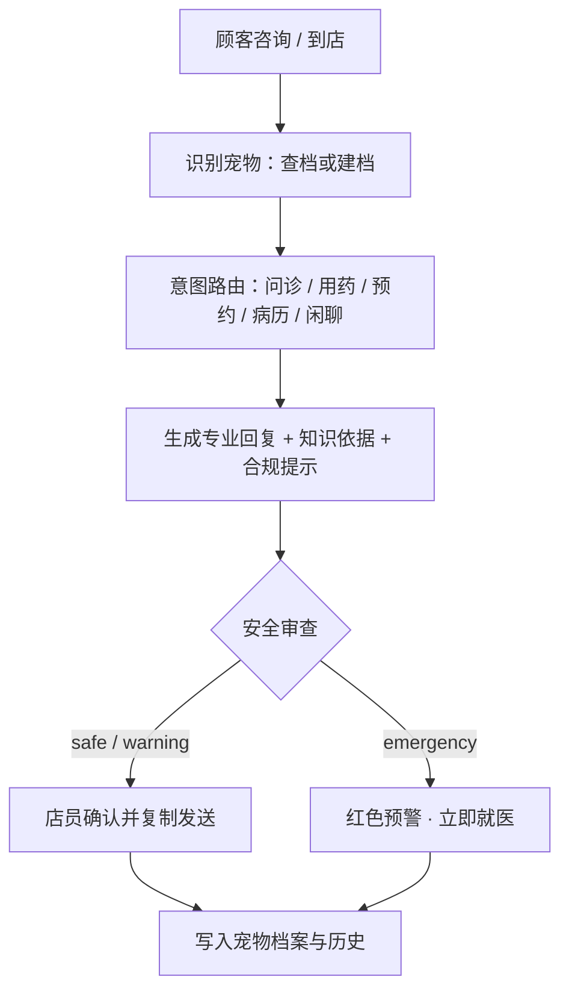
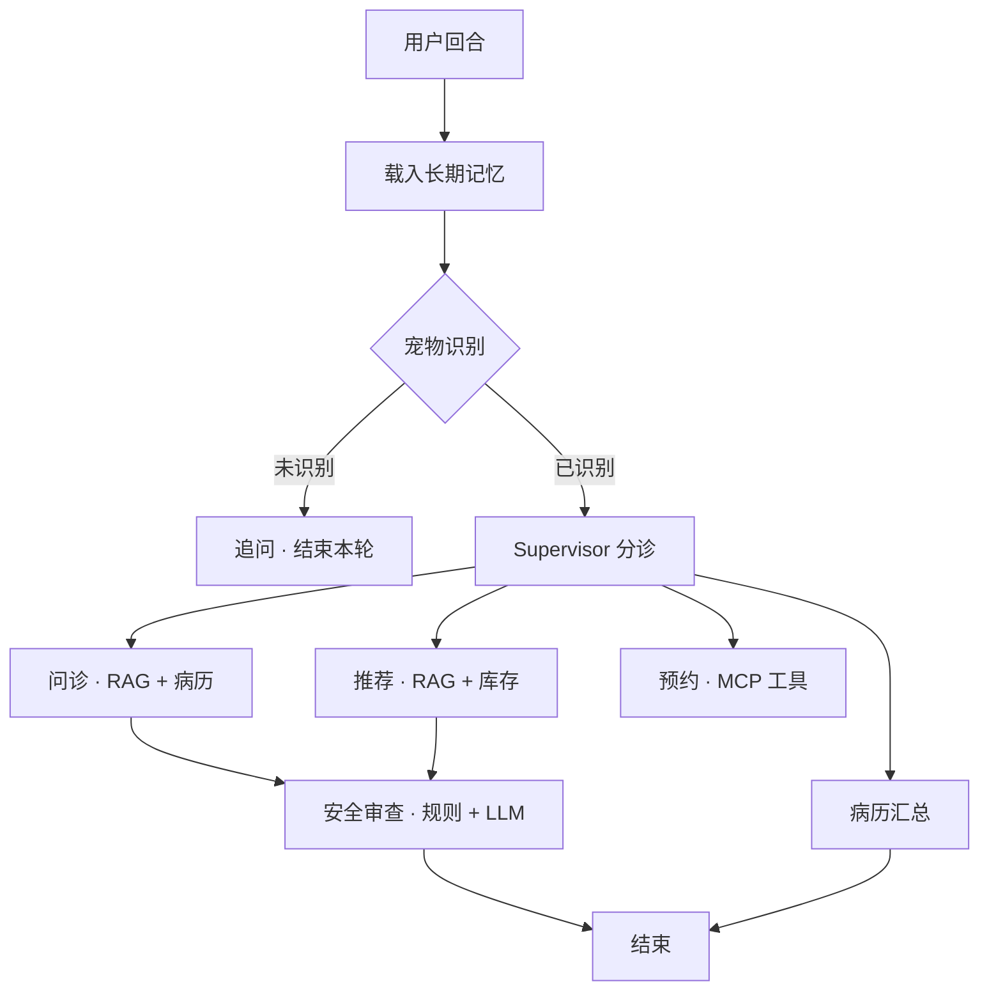

# 宠物店智能问诊与运营助手 · 产品需求文档（PRD）

> 面向中小型宠物门店的 AI 问诊与运营助手，以「店员辅助」为核心，向顾客自助咨询延伸。

> 实现状态标注：**【已实现】** 代码已具备；**【部分实现】** 有基础待产品化；**【规划中】** 本文档新增。

---

## 1. 项目背景与目标

### 1.1 背景与痛点

项目发起人为实体宠物店经营方，面临 **人手不足** 与 **普通店员医疗专业知识不足** 两大约束。核心痛点：

| 编号 | 痛点 | 影响 |
|------|------|------|
| P1 | 高峰期咨询响应慢 | 顾客流失、转化下降 |
| P2 | 店员专业能力不足 | 答不准方向与禁忌，信任下降 |
| P3 | 用药合规风险 | 医疗事故、法律风险 |
| P4 | 服务口径不统一 | 管理成本高、体验割裂 |
| P5 | 经验不沉淀 | 培训与离职成本高 |
| P6 | 预约/库存/病历割裂 | 效率低、信息不同步 |
| P7 | 紧急情况识别缺失 | 延误救治、重大风险 |

### 1.2 产品目标

- **业务目标**：普通店员在 AI 辅助下承接约 80% 常规咨询；高峰期响应降至秒级；统一合规口径；沉淀门店数字资产。
- **用户体验目标**：店员 30 分钟上手；顾客获得即时、专业、可追溯的服务；紧急情况 100% 识别并引导转诊。
- **北极星指标**：**AI 辅助门店接诊单量（有效咨询会话数）**。

### 1.3 非目标

不做诊断与处方、不做药品交易闭环、不追求全病种覆盖、暂不涉异宠深度诊疗。

---

## 2. 用户与场景

| 角色 | 核心诉求 |
|------|----------|
| 普通店员（首要用户） | 快速拿到专业且合规的回复话术 |
| 店长 / 店主 | 数据看板、口径管理、降本增效 |
| 驻店 / 合作兽医 | 审核知识库、处理疑难与转诊 |
| 宠物主人（次要用户） | 即时咨询、预约、查病历 |
| 运营管理员 | 多门店配置、知识库维护、数据监控 |

**核心场景**：到店/线上症状咨询、用药与产品推荐、门店预约、病历查询、紧急识别与转诊、顾客线上自助咨询、店长运营管理。

---

## 3. 产品定位与整体方案

> **店员的一站式「AI 兽医助理 + 业务中台」**：把专业知识、门店业务与合规风控，封装为会问诊、能落地、可追溯的对话式助手。

三条产品线：**店员工作台**（B 端核心，P1）、**顾客自助端**（C 端延伸，P1）、**运营管理后台**（B 端支撑，P1）。现有 MVP 为 CLI 演示，产品化后以工作台为主入口。

**核心业务流程**

---

## 4. 功能需求

### 4.1 功能总览

| 编号 | 功能 | 关键规则 | 优先级 | 状态 |
|------|------|----------|:------:|------|
| F1 | 宠物识别与档案 | 先确认是哪只宠物；名字+物种自动建档；按用户/宠物隔离 | P0 | 已实现 |
| F2 | 症状问诊 | 结合 RAG 与既往病史给出方向/置信度/护理建议；信息不足追问；不越权推荐 | P0 | 已实现 |
| F3 | 用药与产品推荐 | 检索知识库并查库存；标注适用物种/年龄/用法/禁忌；处方药提示遵医嘱 | P0 | 已实现 |
| F4 | 门店预约 | 查询时段、创建预约；三要素齐全才创建；冲突拦截 | P0 | 已实现 |
| F5 | 病历查询 | 汇总基本档案 + 既往问诊 + 门诊病历；外部缺失不显示噪声 | P0 | 已实现 |
| F6 | 安全审查与兜底 | 规则 + LLM 双通道分级；emergency 停止推荐并引导就医 | P0 | 已实现 |
| F7 | 记忆系统 | 短期会话 + 长期用户/宠物档案与历史；数据库不可用自动降级 | P0 | 已实现 |
| F8 | 上下文工程 | 摘要压缩、Top-3 RAG 注入、职责隔离、执行轨迹 | P0 | 已实现 |
| F9 | 店员工作台 | 对话辅助、档案侧栏、风险横幅、一键话术、转人工 | P1 | 规划中 |
| F10 | 顾客自助端 | 小程序/H5 自助问诊与预约、我的宠物 | P1 | 规划中 |
| F11 | 运营管理后台 | 知识库/话术/安全规则维护、权限与账号 | P1 | 规划中 |
| F12 | 数据与埋点 | 北极星及效率/质量/转化/成本指标 | P1 | 规划中 |

### 4.2 关键功能说明

**F2 症状问诊**：两阶段执行（Agent 产出自然语言答复 → 结构化抽取字段），规避工具调用死循环；检索 Top-3 知识片段并注明来源；只问诊、不推荐产品。验收：必须包含「可能方向 + 置信度 + 护理建议」，信息不足时 100% 追问。

**F3 用药与产品推荐**：推荐前检索知识库并校验库存；每条含名称/类别/理由/用法/参考价；处方药与跨物种用药风险强制提示。验收：处方药 100% 带合规提示，适用物种字段非空。

**F6 安全审查**：规则层命中紧急关键词（中毒、误食、大量出血、呼吸困难、抽搐、昏迷、便血等）即判 emergency；未命中由 LLM 分级；审查不可用默认 warning 保守处理。验收：关键词召回 100%，emergency 场景 0 违规产品推荐。

**F9 店员工作台（规划）**：店员始终为「发送者」，AI 提供草稿与依据；风险信息置顶不可忽略；支持「专业版/顾客版」话术切换。原型见附录 A。

### 4.3 权限矩阵（简）

| 能力 | 店员 | 店长 | 兽医 | 顾客 |
|------|:---:|:---:|:---:|:---:|
| 辅助问诊 | 是 | 是 | 是 | 是（仅本人宠物） |
| 创建预约 | 是 | 是 | 否 | 是 |
| 查看经营看板 | 否 | 是 | 否 | 否 |
| 维护知识库 / 安全规则 | 否 | 审核 | 是 | 否 |
| 账号与权限管理 | 否 | 是 | 否 | 否 |

---

## 5. AI 能力设计

- **多 Agent 架构**：Supervisor 分诊调度 + 5 个 Worker（问诊 / 推荐 / 预约 / 病历 / 安全审查）。仅在新用户回合调用 LLM 判断意图，Worker 返回后确定性推进，避免重复派发。
- **RAG 知识库**：约 1.2 万条知识片段，本地多语言向量库；问诊注入 Top-3，外文检索时翻译为中文。
- **记忆系统**：短期会话记忆 + 长期用户/宠物档案与历史，按命名空间隔离。
- **MCP 业务工具**：预约、库存、病历通过 MCP 协议接入，工具可替换、可扩展。
- **安全分级**：规则层保证高召回（关键词）+ LLM 层语义分级，双层兜底。

**系统架构与调度**

---

## 6. 非功能需求

| 类别 | 要求 |
|------|------|
| 性能 | 首字节 ≤ 3s；单轮完整回复 P95 ≤ 15s；知识检索 ≤ 1s；单店并发 ≥ 20 路 |
| 降级 | 数据库/知识库/MCP/模型不可用时逐级降级，核心对话可用 |
| 安全与隐私 | 按用户/宠物隔离；密钥仅存服务端；顾客信息最小化收集 |
| 合规 | 所有输出附免责声明；处方药仅提示遵医嘱；紧急情况强制引导就医；话术经兽医审核 |
| 可观测性 | 节点级执行轨迹、安全分级、意图路由、RAG 命中可回放排查 |

---

## 7. 项目里程碑

| 阶段 | 目标 | 交付内容 | 状态 |
|------|------|----------|------|
| P0 · MVP | 核心能力验证 | 多 Agent + RAG + 记忆 + MCP + 安全（CLI） | 已完成 |
| P1 · 产品化 | 门店可用 | 店员工作台、话术一键发送、风险横幅、登录与权限 | 规划中 |
| P2 · 顾客端 | 服务延展 | 小程序/H5 自助咨询与预约、我的宠物 | 规划中 |
| P3 · 运营化 | 规模化 | 运营后台、数据看板、转人工工单 | 规划中 |
| P4 · 智能化 | 体验升级 | 图片识别、语音、主动回访、多门店多租户 | 规划中 |

---

## 8. 风险与应对

| 风险 | 等级 | 应对 |
|------|:----:|------|
| 模型幻觉导致错误建议 | 高 | RAG 引用来源、保守话术、兽医审核、免责声明 |
| 处方药 / 跨物种用药违规 | 高 | 强制合规提示、安全审查、知识库约束 |
| 紧急情况漏判 | 高 | 关键词高召回 + 模型复核 + 转人工 |
| 数据隐私泄露 | 中 | 租户隔离、最小化收集、审计 |
| LLM 成本过高 | 中 | 摘要压缩、Top-K 控制、缓存、小模型分流 |

---

## 9. 验收标准与开放问题

**验收标准**：F1-F8 稳定运行且异常可降级；紧急场景 100% 识别转诊；处方药 100% 合规提示；数据按用户/宠物正确隔离；意图路由准确率 ≥ 90%；店员 30 分钟内可独立上手。

**开放问题**

1. 店员工作台优先做 Web 还是平板 Pad？门店设备现状如何？
2. 是否与门店现有会员 / 小程序体系打通？
3. 知识库的兽医审核流程与责任人如何确定？
4. 是否需要对接现有 POS / ERP 系统？
5. 多门店 / 连锁是否为近期目标（决定是否提前做多租户）？
6. 单会话可接受的 token 成本上限？

---

## 附录

### A. 界面原型

**店员工作台（B 端核心）**

**顾客自助端（C 端延伸）**

### B. 现有实现映射

| 功能 | 对应实现 |
|------|----------|
| F1 宠物识别与档案 | `petdoctor/identity.py`、`memory.py` |
| F2 症状问诊 | `petdoctor/agents/ask_symptom.py` |
| F3 用药与产品推荐 | `petdoctor/agents/recommend_product.py` |
| F4 门店预约 | `petdoctor/agents/appointment.py`、`mcp_server/server.py` |
| F5 病历查询 | `petdoctor/agents/record.py` |
| F6 安全审查 | `petdoctor/agents/safe_check.py` |
| F7 记忆系统 | `petdoctor/memory.py` |
| F8 上下文工程 | `petdoctor/agents/supervisor.py`、`graph.py` |
| F9-F12 产品化 | 规划中，需新建前端与后台工程 |

> 本文档为产品规划，涉及医疗建议的部分均不构成诊断或处方，实际诊疗须由执业兽医实施。
